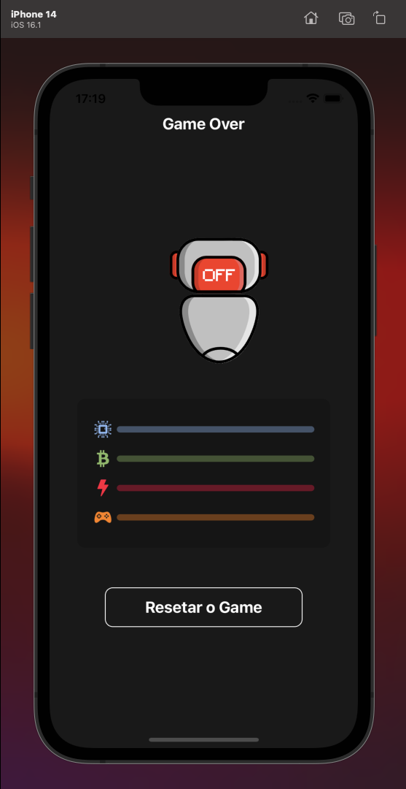

# Aplicativo OneBitLife

## 💻 Sobre o projeto

O aplicativo **OneBitLife** é um projeto desenvolvido durante a **Semana Mobile da [OneBitCode](https://onebitcode.com/)**. O objetivo dele é fazer um gerenciamento de tarefas, que ajudam o usuário a fixar hábitos melhores e mais saudáveis em sua vida. De uma forma bem visual, o BIT, nosso robô, alerta o usuário caso ele não esteja cumprindo suas tarefas da forma que foi planejada. O robô vai mudando de humor e a barrinha que indica que ele está progredindo, vai diminuindo, até que ele pode morrer, caso as tarefas não sejam cumpridas.

<div > 

 

</div>

## Tela de gameover



## ⚙️ Funcionalidades

- Criar os hábitos que deseja melhorar

- Criar notificações

- Editar os hábitos

- Excluir os hábitos

- Marcar a tarefa como concluída

## 📡 Tecnologias utilizadas

<div align="center"> 


</div>

<br/><br/>

## [](https://github.com/eliaslma/onebitlife-app) 🚀 Como executar o projeto

### Pré-requisitos

Antes de começar, você vai precisar ter instalado em sua máquina as seguintes ferramentas:

[Git](https://git-scm.com), [Node.js](https://nodejs.org/en/) e [Expo](https://expo.dev).

Além disto é bom ter um editor para trabalhar com o código como [VSCode](https://code.visualstudio.com/).

#### 🧭 Rodando a aplicação


```bash

# Clone este repositório

$ git clone https://github.com/eliaslma/onebitlife-app.git

# Acesse a pasta do projeto no seu terminal/cmd

$ cd onebitlife-app

# Instale as dependências

$ npm install

# ou

$ yarn

# Execute a aplicação

$ expo start

```

## [](https://github.com/eliaslma) 👨‍🚀 Autor


<a href="https://github.com/eliaslma">

 

 <br />

 <sub><b>Elias Lima da Silva</b></sub></a>

In ☕ We Trust!

Entre em contato:

[](https://www.linkedin.com/in/elias-lima-da-silva-a933a713a/)
[](https://api.whatsapp.com/send?phone=5544997075632&text=Olá!)
[](mailto:sci.eliaslima@gmail.com)

